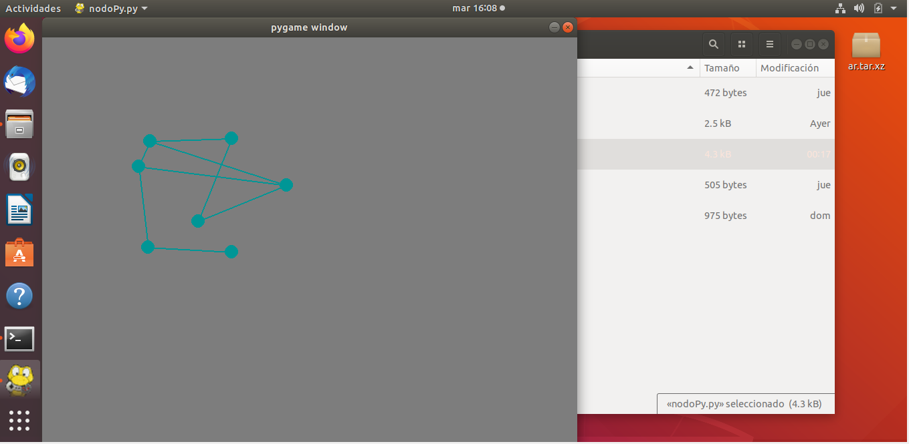

## Generador basico de grafos.
# Librerias necesarias
- pygame 

Se puede instalar con
      
   ` 
   sudo apt-get install python-pygame
   `
   o usando:
  `
  pip install pygame
  `
# Ejecutar
`
python3 nodoPy.py
`
# Programa corriendo

